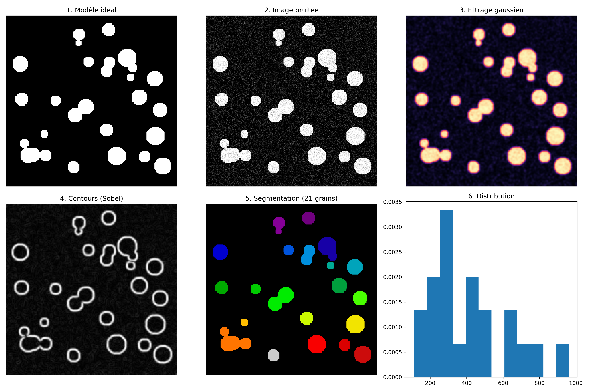

# Simulation et Analyse de Structures Granulaires 🔬

Ce projet présente un pipeline complet de traitement d'images numériques appliqué à la caractérisation de microstructures. Il permet de passer d'une image brute bruitée à une extraction statistique de paramètres physiques.

## 📄 Rapport Complet
Le rapport détaillé détaillant la méthodologie et les résultats est disponible ici : [Consulter le PDF](./Projet_Simulation_et_analyse_d_images.pdf)

## 📊 Aperçu des Résultats
Voici la planche complète générée par l'algorithme :

### Points clés du pipeline :
* **Simulation** : Création d'un modèle idéal de grains.
* **Prétraitement** : Ajout de bruit gaussien et filtrage.
* **Segmentation** : Utilisation de la méthode d'Otsu pour une détection automatique.
* **Analyse** : Extraction de la distribution granulométrique (aire moyenne, écart-type).

## 🛠 Technologies
* **Langage** : Python
* **Bibliothèques** : Scikit-image, NumPy, Matplotlib

---
*Projet réalisé par Babacar NDIAYE - Master 2 Physique.*
